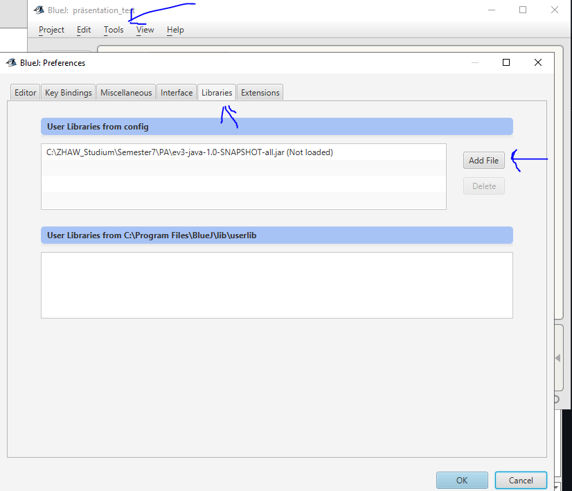
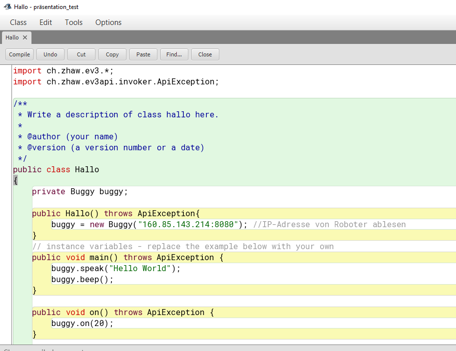

# Setup Java Client

## Prerequisites

- Have [BlueJ](https://www.bluej.org/) installed on your system

## Setup

1. Download from [GitHub](https://github.com/EV3-OpenAPI/EV3-API/releases/) the latest .jar-file release
2. Start your IDE and create a new project (Project > New Project...)
3. After your generate a new project, you have to add the .jar-file to the project. **See example**:

4. Now you are ready to import the library in your project. Open your project and import the library. **See example**: `import ch.zhaw.ev3.*;` and `import ch.zhaw.ev3api.invoker.ApiException;` 
5. **Now you are ready! Happy Coding!**
